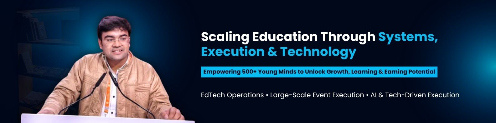

<div align="center">

</div>

<a href="https://git.io/typing-svg">
  
</a>

<br/>


</div>

---

## $ whoami

```yaml
name        : Koushal Acharya
location    : Jaipur, Rajasthan, India
education   : B.Tech CSE — Poornima Institute of Engineering & Technology (2023–2027)
founded     : Diksha Education (2019) — 1,500+ students · 500+ educators
events      : IPL 2025 & 2026 · IIFA Awards 2025 · 50+ live events with BookMyShow & District by Zomato
builds_with : Node.js · MySQL · JavaScript · HTML/CSS · Cursor AI · Claude AI
open_to     : Operations · Growth · Founder's Office · EdTech · Software Internships
```

---

## What I Build & Run

<table>
<tr>
<td width="50%" valign="top">

**🎓 Diksha Education**
*Founded 2019 — running since age 16*

Home & online tutoring platform, built from scratch with no funding and no blueprint.

- 1,500+ active students
- 500+ onboarded educators
- Systems: CRM · Scheduling · Onboarding · Revenue workflows
- Still running. Still growing.

</td>
<td width="50%" valign="top">

**🏟️ Large-Scale Event Operations**
*BookMyShow · District by Zomato*

On-ground execution for India's biggest live events.

- IPL 2025 & 2026 — SMS Stadium, Jaipur
- IIFA Awards 2025 — led 65-member ops team
- AP Dhillon · Karan Aujla · Comic Con · 50+ events
- 24,000 spectators per match · 300+ volunteers

</td>
</tr>
</table>

---

## Projects

> Focused on operational utility and practical problem-solving.

**📋 Job Application Tracker** &nbsp;·&nbsp; `Node.js` `Express.js` `MySQL`

Role-based system for tracking job applications by status. Admin visibility, REST API, structured data workflows. Built using AI-assisted development with Cursor AI + Claude AI.

&nbsp;&nbsp;[→ View Repository](https://github.com/koushalacharya09/job-application-tracker)

---

**📊 Student Attendance System** &nbsp;·&nbsp; `Node.js` `Express.js` `MySQL`

Centralized dashboard with role-based access for Admins, Teachers, and Students. Real-time attendance marking, shortage alerts, and admin reporting.

&nbsp;&nbsp;[→ View Repository](https://github.com/koushalacharya09/student-attendance-system)

---

**🍽️ Restaurant Booking Platform** &nbsp;·&nbsp; `HTML` `CSS` `JavaScript` `Node.js`

Responsive booking site with dynamic menu, mobile-friendly UI, and server-side confirmation. Frontend UX to backend workflow — end to end.

&nbsp;&nbsp;[→ View Repository](https://github.com/koushalacharya09/restaurant-booking-platform)

---

**🌦️ Weather & News Dashboard** &nbsp;·&nbsp; `JavaScript` `REST APIs`

Live data aggregator using public APIs. Debounce search, localStorage support, responsive layout.

&nbsp;&nbsp;[→ View Repository](https://github.com/koushalacharya09/weather-news-dashboard)

---

## Tech Stack

**Languages**
&nbsp;


**Web & Backend**
&nbsp;


**Databases & Tools**
&nbsp;


**AI & Productivity**
&nbsp;


---

## GitHub Stats

<div align="center">


&nbsp;


</div>

---

## Achievements

| | Recognition | Year |
|---|---|---|
| 🥇 | Smart India Hackathon — Internal Winner, Poornima Institute | 2023 & 2024 |
| 🚀 | Top 100 Startups — Rajasthan iStart BuilderX Program | 2025 |
| 🧪 | Core Member — AICTE IDEA Lab, Poornima Institute | 2023–2025 |
| 🏛️ | Government Delegate — Rising Rajasthan Global Investment Summit | Dec 2024 |
| 🌍 | Government Delegate — Pravasi Rajasthani Divas | Dec 2025 |
| 📰 | Featured — Global Footprints, Poornima Annual Magazine | 2025 |

---

## Connect

<div align="center">

[](https://linkedin.com/in/koushal-acharya09)
&nbsp;
[](mailto:koushalacharya3009@gmail.com)

</div>

---

<div align="center">


*"I don't wait for perfect conditions. I execute with what I have."*

</div>
